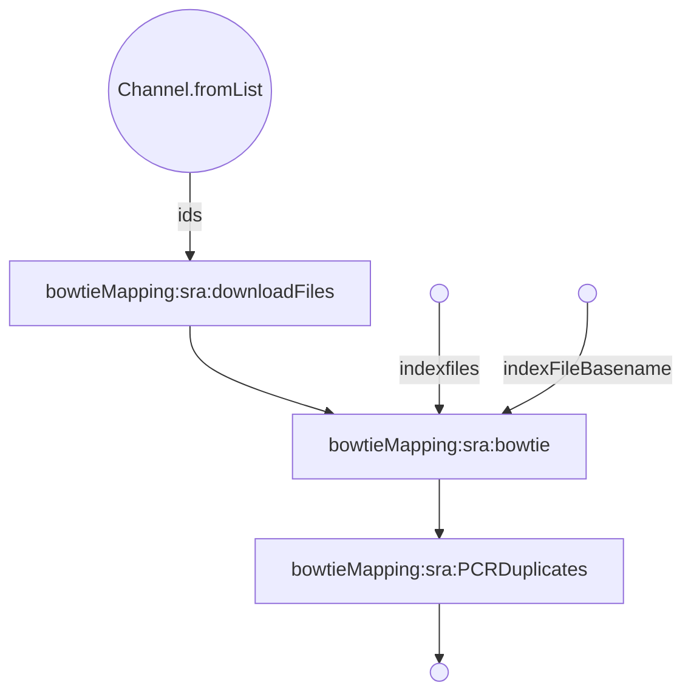
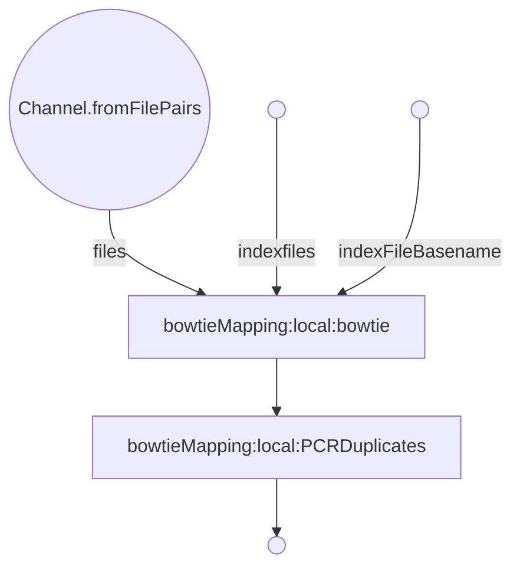

THIS REPO IS 🚧 UNDER CONSTRUCTION 🚧 and NOT Used in ANY production CODE
# bowtieMapping

***
bowtieMapping (From sra download)
***  

***
bowtieMapping (from local files)
***  

Description of nextflow configuration parameters:

| param         | value type        | description  |
| ------------- | ------------- | ------------ |
| inputFilePath  | string | Path to input file |
| outputDir | string | Path to where you would like output files stored |
| databaseFasta | string | Path to the fasta file that you would like to use a the database for Psipred |
| preconfiguredDatabase | boolean | Are you using a preconfigured database? |
| writeBedFile | boolean | If you would like to output an additional bedfile. |
| isSingleEnd | boolean | Is the data single-end or paired-end? |
| isColorspace | boolean | Is the data colorspace data? |
| removePCRDuplicates | boolean | Would you like PCR duplicates removed? |
| input | path | Path to input tsv file if downloading from sra or path to directory holding input files |
| downloadMethod | string | Either 'sra' or 'local' |
| databaseFileDir | path | Path to database file dir|
| indexFileBasename | string | Basename for bt2 files. Ex "index" if files start index.1.bt2, index.2.bt2, etc |
| mateAQual | path | Path to qual file for mateA |
| mateBQual | path | Path to qual fiel for mateB |

### Get Started
  * Install Nextflow
    
    `curl https://get.nextflow.io | bash`
  
  * Run the script
    
    `nextflow run VEuPathDB/blastSimilarity -with-trace -c  <config_file> -r main`
